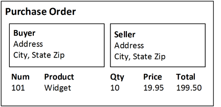
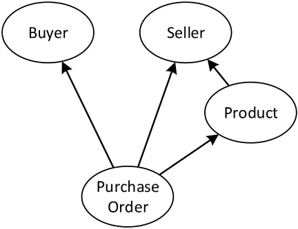
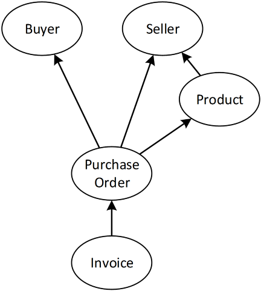

# The Rules of Historical Modeling

I have uncovered some of the assumptions under which the software industry has been constructing systems for several decades. One assumption states that there is one true state of an entity, and that that state can be Created, Read, Updated, and Deleted. Another asserts that procedure calls can be made across machine boundaries. Another says that the system of record must be the deciding party.

These assumptions have crept into the very tools that we use to build software. In an object-oriented language, the property of an object has a single value. It does not represent the multitude of possible values that the property might have on different machines. In a relational database, UPDATE and DELETE are first-class commands that permit destruction of information. In HTTP, requests block until the response is available, mimicking the behavior of a procedure call. In REST, a URI identifies not only the resource, but also names the system of record that must be contacted to get its current representation.

As I uncovered these assumptions, I revealed the problems that they cause. When we use tools that are built on top of these assumptions, we will have a difficult time avoiding these problems. Instead, I propose that we construct a new set of assumptions, and from those derive a new set of tools. This chapter lays out those assumptions, and defines them as the rules of Historical Modeling.

## The nature of historical facts

Let's go back in time to a world before computers. How was business transacted in this world? Rather than updating the current state of the world in a large database, information was recorded and shared in the form of documents.

Suppose a customer places an order for ten widgets. This decision is captured as a purchase order. The purchase order references the two parties: the buyer and the seller. It also references the product – widgets – by the catalog number assigned by the seller.


 
The purchase order is a **fact**. It is a historical document that records a decision. It is immutable: neither party can change the purchase order itself. They can only amend this document with another one.

The purchase order fact refers to a few other facts that came before. It refers to the buyer and the seller as distinct legal entities. These entities were created with their own set of historical facts – documents that were filed with their respective regulating bodies as articles of incorporation. These facts were created well in advance of the purchase order.

The purchase order fact also refers to the catalog number. This is a historical fact that the widget was published in a catalog of available products with a listed price. The catalog, once published, is not changed. It is only amended by publishing subsequent catalogs adding and removing products, and changing their prices.
 


All of these facts that came before the purchase order – the buyer, the seller, the product – are **predecessors**. A predecessor is a fact that necessarily came before. A fact cannot refer to another fact that came after; that would only be possible if facts could be altered. At the time the fact was created, the successor did not exist.

Let's continue the story of the buyer and the seller. The seller receives a copy of the purchase order, and then sends the buyer an invoice. The invoice is another historical fact. The predecessor of this fact is the purchase order.



The inverse relationship to predecessor is **successor**. The invoice is a successor of the purchase order. Facts don't directly know their successors. They cannot, since they are immutable. But the system can be queried to find the successors of a given fact. This is how a system made up of immutable facts can appear to change. Successors accrue over time, and thereby change the results of a query.

Both the buyer and the seller in this story have their own view of the world, based on a **subset** of history. At any given time, these world views may differ. The buyer knows about the purchase order before the seller does. And the seller knows about the invoice before the buyer. There is no single state of the system, and no authoritative source of truth. Nevertheless, every party eventually learns of all facts in the system. They understand the predecessor/successor relationships among these facts. Each party examines the subset of information available to them at the time to draw their own conclusion about current state, and the transaction eventually draws to completion.

The nature of historical facts, in summary, is that:

- Facts are **immutable**
- Facts refer to others that have come before: their **predecessors**
- The system can be queried to find the **successors** of a given fact
- Only a **subset** of history can be known at any given time

Remember that our story of buying and selling takes place before the creation of computers. Historical facts have behaved according to these rules since the dawn of recorded history – literally.

### The rules of historical models

The nature of historical documents leads us to a specific set of rules. By this, I don't mean suggestions or best practices. These are strict formal rules that follow directly from the nature of facts. We start with the goals, and from there derive the rules that must be true if those goals are to be met.

We'll define the goals in terms of **facts** (units of information) and **nodes** (individual actors who observe the facts). A node is typically a single machine in a computer network. A node observes – or knows about – certain facts within the system. The decisions that it makes are deterministic, and based only upon the facts it observes and input that it receives directly. The goals are these:

- Information is never destroyed
- Nodes behave independently
- Each node observes only a subset of all facts
- Nodes tend toward consistency

Beginning with the first goal, then, we derive the first rule. If a fact is the unit of information, and information is never destroyed, then it follows that...

> Facts are immutable

A fact records an action or a decision that was made at any given node at some point in time. Once that decision is made and recorded, it is forever true. The fact of its historical existence cannot be changed or deleted.

Now that doesn't mean that we cannot change our minds. We are certainly free to make a new decision. When we do, this new decision is recorded as a new fact. The old fact still exists, but it now co-exists with a new fact. We must find a way to reconcile a system in which both facts exist, and to understand what it means.

The immutability of facts must somehow not impede progress. It must not conflict with fourth goal: the tendency toward consistency. That is how meaning evolves as the system progresses from one historical fact to the next. To accomplish that, we must honor the second rule.

> A fact refers to its predecessors

To understand the meaning of a system in which two contradictory decisions co-exist, we must understand which one came first. Did one decision supersede the other, or did they arise independently? If one fact has knowledge of another, then we can conclude that it represents a modification of or amendment to the first. But if neither fact knows about the other, then we recognize that they exist in conflict, requiring a later decision.

The predecessor relationship captures all of this information. If one fact refers to another, and if those facts can't be changed, then the fact must follow the one to which it refers. It must have occurred later in time. The predecessor preceded its successor in the very literal sense of the word: it happened earlier in time.

> Predecessors occurred before successors

The predecessor relationship also captures the knowledge of the prior fact. The second decision was made with the knowledge of the first. The first couldn't have known about the second; it hadn't happened yet. But the second clearly knew about the first. We know that the predecessor wasn't added after-the-fact, because facts are immutable.

The presence of a successor changes the interpretation of its predecessor. The existence of the first fact is not in dispute. The content of the first fact is unchanged. The first fact is not destroyed. But its meaning changes in light of its successor. Based on how successors are used, this new meaning can augment, replace, or even nullify the original intent.

### Partial order

If the rules outlined above were the only conclusions we drew, then we could model a historical system in a number of ways. For example, we could line all of the facts up in the order in which they occurred, and let each one refer back to its immediate predecessor. This stream of events would form a chain stretching back to the beginning of time. However, such a model would not permit us to satisfy all of our goals. Specifically, this choice would not allow nodes to behave independently, or to observe only a subset of facts.

For nodes to behave independently, they need to be authorized to make and record decisions without consulting with their neighbors. This must inevitably lead to the existence of two or more facts that do not refer to one another as predecessors. If neither of two facts refers to the other, then we cannot clearly say which of the two came first. We cannot impose a total ordering of facts.

> Facts allow a partial order

The terms "total ordering" and "partial ordering" come from mathematics. A set is totally ordered if you can identify, for any given pair of elements, which one came before the other. A totally ordered set is like the counting numbers. You can clearly enumerate the order in which they must occur.

A partial order, however, allows some ambiguity. There are some pairs for which the before/after relationship is not known. When it is not clearly stated, then either order must be allowed. A partially ordered set is like a genealogy. I know that I am the child of – and therefore came after – my father. But if I compare myself with someone with whom I share no family relationship, then the order is unclear. I speak here only of parent/child relationships, not birth order. So by this definition, I cannot even say whether I came before or after my brother (even though he is older).

The "comes before" part of the predecessor relationship is called **causality**. A predecessor is causally related to its successor. Two facts that are not causally related are called concurrent. These definitions are a bit different from common vernacular. A predecessor does not necessarily "cause" the successor in any real way. Nor can we say that two unrelated facts indeed happened "concurrently". However, these are the accepted definitions given by Leslie Lamport (Time, Clocks and the Ordering of Events in a Distributed System), and so we continue to apply them.

We borrow many truths about historical facts from the mathematical definition of partial order. One that plays particular importance is this.

> Causality is transitive

If one fact is the predecessor of a second, and the second is a predecessor of a third, then the first comes before the third. We don't need to explicitly list the first as a predecessor of the third. The fact that it came before is inferred by the transitive nature of causality.

So given any two facts, I might be able to follow a chain of predecessor relationships from one to the other through some number of intermediates. But then again, I might not. These two facts might have occurred independently on different nodes. These two nodes have the authority to make and record decisions without consulting one another. The model must allow a partial order if nodes are to be permitted to act independently.

### Collaboration

Let's further examine the goal of nodes tending toward consistency. Nodes will use facts as a means of communication. They share facts with one another. Once a node learns of a fact, then it observes it. It brings it into its model of the world, upon which it will base all future decisions.

For nodes to use facts as a means of communication, each node must recognize when a fact learned from a neighbor is actually one that it already observes. The collaborators need to identify facts, and know when they are indeed the same. That identity must be deterministic. If two nodes exchange two facts, they must both agree whether they are indeed the same. If a third node enters the conversation, it must make the same determination. The only way to guarantee determinism in a system of independent nodes is to introduce the following rule.

> A fact is identified by its content

The rule is two-fold. First, if two nodes observe two facts that have exactly the same contents, then they are both actually observing the same fact. And secondly, there is no subset of a fact's contents – and no identifying attribute apart from its contents – that can be taken as an identifier. The identity of a fact is its content, its whole content, and nothing but its content.

The need for this rule comes from the goal that nodes behave independently. When a node makes a decision, it must be able to record that decision as a fact without the need to consult any other node. It should not need to allocate a unique identifier by consensus, pre-arrangement, or central authority. Using the content as the identity is the only deterministic way to guarantee uniqueness.

It should be stated that the content of a fact includes the identities of its predecessors. Two facts that are similar in all respects, except that they refer to different predecessors, are indeed discrete facts. This observation is not to be taken lightly, however. Remember that the identify of a fact is the same as its content. Therefore, in a very real sense...

> A fact contains its predecessors

If a fact knows the identity of its predecessors, and that identity is their content – including their predecessors – then a fact actually contains its entire lineage. This implies that not only is causality transitive, but so is observation.

> If a node observes a fact, then it also observes that fact's predecessors

This set of rules governing the identity of facts is peculiar to Historical Modeling. Most other systems define an identity separate from – or as a subset of – the content of a record. Relational databases, for example, assign a primary key to the rows of a table. The key is only part of the content of the row. Other columns contain data related to that key. Document databases, as another example, typically define an ID separate from the content of a document. One useful function of these systems is to fetch a record by its key or ID. An actor can know the key or ID, but still not know the content of the record.

In a Historical Model, however, an actor that knows the identity of a fact already knows its content. It therefore makes no sense for such a system to offer "fetch" as a function. The identity also includes the identities of the predecessors, so "find predecessors" is not a useful function either. Anyone capable of asking the question already knows the answer. The only function that makes sense in a historical system is "find successors". That is a function that we will make much use of in the remainder of this book.

We have derived the rules of Historical Modeling from the goals. The goals are to model a system in which no information is destroyed, nodes act independently, observe a subset of facts, and approach consistency. These goals lead directly to a set of rules. Facts are immutable. They refer to their predecessors, with which they define a partial order. The content of a fact is also its identity, which includes the identities (and therefore contents) of its predecessors. The only useful operation is therefore to query for the successors of a given fact.

I have shown that these rules are necessary given the goals of Historical Modeling. I hope to also convince you by the end of the book that they are sufficient.

### Timeliness

In a system based on the exchange of historical documents, not all parties will know about all facts at the same time. This is one of the greatest strengths of historical modeling, but also one of its important limitations. It is impossible to reject a fact based on the time at which you learn of it. The reason is that other parties will have learned about it earlier, and would therefore have come to a different conclusion about the fact. For every party in the system to eventually reach the same conclusion, that conclusion cannot be based on timeliness.

This causes significant problems in systems that do not recognize this limitation. Several legal documents, such as tax forms, checks, and invoices, have explicit due dates or expiration dates. If the form is received after the required date, then it will not be honored. The sender must go to great lengths to prove that the document was written and transmitted on time, or suffer the consequences of a failed transaction. In such situations, the sender believes one thing – that he met the deadline – while the recipient believes something else. Only by arbitration of a central authority can these situations be resolved.

To design a system that does not rely upon a central authority, we must respect that documents will be received late. In a truly historical model, a fact is not rejected based on the time at which it was received. At best, we can record the fact that a fine was levied or an opportunity was lost due to the failure of information to arrive at a certain place by a certain time. But we cannot prove that the information did not exist somewhere else at that time. And when the fact arrives later, we must decide how we are to react to it. All parties must honor the existence of the facts, no matter when they learned about them, and draw the same conclusion. Perhaps that conclusion is that the sender still owes a fine. But timeliness alone did not determine that outcome.

Such are the rules of a historical model. They follow logically from the desire to capture the full history of a system with several parties, separated by time and space, exchanging historical facts via documents. Those documents must be immutable. Two documents having the same content represent the same historical fact. We cannot guarantee – and therefore cannot rely upon – there being only one successor for any given fact. And we cannot change our interpretation of history based on the timeliness of our knowledge of it.

## Limitations of historical models

With the power of historical modeling comes some constraints. These constraints make it inappropriate to apply historical modeling to certain types of systems. In these situations, it is best to model all or part of the system statically – that is, using a method that captures current state – and integrate where appropriate. Fortunately, good integration strategies are available.

### No central authority

A historical model allows for decisions to be made with autonomy. Each decision is recorded in the local history, and eventually shared with the rest of the system. As a result, the system cannot reject facts based on age or current state.

Decisions that were made in the past are approved locally, with only the information available at the time. No remote part of the system needs to be consulted. That decision cannot be rejected post-facto.

This makes historical modeling inappropriate for parts of a system that require a central authority. For example, a conference room reservation system will need to know with certainty whether a room was available at a certain time. When a reservation is approved, the approver needs to know that no other reservation for the same room at the same time has been approved. That decision must be made by a central authority.

A historical model may be applied around the edges of a central authority, so long as that central authority itself is using a static model. The historical model can capture the fact that a request has been made. This occurs at the point of request, such as at a user's workstation or a device mounted by the door, and these facts find their way to a central authority. The historical model can also capture the fact that a request was approved. This occurs at the central authority and moves out to the devices at the edge. But a historical model alone cannot say for certain whether a room is available at any given time. That would require that the model know that a reservation has not been approved, which is impossible given a subset of history.

To solve the problem, the system should include a central authority with a static model. The historical model records the reservation requests and approvals, but the static model determines availability. The central authority need not be a single machine; it could be a cluster of machines. As long as the members of this cluster have access to the same static model, they can act with singular authority. The shared static model needs a locking mechanism to help this cluster coordinate their actions. Relational databases support transactions, which answer this need well.

The central authority will then record the approval or rejection of the request as a successive fact. This fact will find its way back to the client from which the request came. The historical model provides all of the benefits previously mentioned: a complete history of the request, an eventually consistent view of current state, and a mergable communication mechanism. The one component that is better modelled statically is the one that requires central authority: room availability.

### No real-time clock

A time-sensitive request must be fulfilled within a specified period of time. If it is not, the request is invalid. Such requests are common in real-time systems such as factory automation. A request for a door to open or a robotic arm to move must be fulfilled within a narrow span of time. If the message does not arrive in time, then the request must be rejected.

Facts in a historical model, however, are honored no matter what the time frame. The decision is made at the time that the fact is recorded, and cannot be rejected thereafter. It may take an indeterminate period of time to transmit the fact. The recipient is simply informed of something that has already happened in history.

While it might be appropriate to model the input or output of a real-time factory automation system historically, the software that runs the factory itself should use a real-time model. These models are specifically designed to provide time-sensitive fail-safe behavior. If a message fails to arrive at the right time, the system defaults to safe operation. And once the message does arrive, late as it is, the system ignores it so as not to cause any damage.

### No uniqueness constraints

In a historical model, any query for successors of a fact might return multiple results. It is not possible to constrain a query to return only one result. The consequence of this is that a domain that requires at most one result cannot effectively be modelled historically.

For example, a login that requires a unique user name should be supported by a static model. A historical model would be unable to enforce the uniqueness of a user name.

At best, a historical model might include a fact containing only the user name. Because a fact is uniquely identified by its value, there is logically only one fact with this exact user name. However, the fact could contain nothing that could differ from one user to the next. If it contained information in addition to the user name, then two or more facts could again exist with the same name. They would no longer be unique.

To correlate a distinct user name with a user, therefore, would require a successor fact. Identifying the user for a given user name would require a query for the successors of the user name fact. Such a query cannot be guaranteed to return at most one fact. The possibility always exists for it to return more.

To model a system that requires uniqueness constraints, you must use a static model. The model can be consulted to determine if the desired value is already in use. The indexing and transactional features of a relational database once more come into play.

That static model must also be centrally located. A replica of a static model cannot enforce uniqueness. An insertion into one copy would need to block in order to consult the others. Only if that unique value is not reserved in a quorum (usually a simple majority) of replicas can it be accepted. A consensus algorithm such as Paxos can be employed to reach a quorum.

If uniqueness is required, such as registering for a user name, a historical model could be used for registration requests, as well as for acceptance or rejection responses. The requests can be recorded as facts by clients at the edge of the system. These facts will make their way to a central authority that has access to a static model. The static model enforces uniqueness constraints. That central authority will decide whether to approve or reject the request based on the static model, and then record that decision as a successor fact.

The response will find its way back to the client from which the request came; only then will the client know whether the requested user name is unique. They will query for successors to the request fact – the acceptance or rejection. Once they have one successor, they will know the answer to the uniqueness question. However, there is no guarantee in the historical model itself that the request will have no further successors! That assurance comes only from the trust that a central authority is making the decision, with the help of a static model that can enforce uniqueness.

### No aggregation

After a certain amount of activity, a system might be expected to provide an aggregate or summary of that period's activity. For example, a financial ledger could be closed at the end of a day, a month, or a quarter. The system would then produce a summary that records the total of that period's transactions. From that point forward, no additional transactions would be allowed into that period.

A historical model cannot guarantee that all facts within a given period have been seen. The system responsible for generating the aggregate might not have all of the period's records at the required time. If it receives a fact after computing and recording the summary, then it is not permitted – by the rules of historical modeling – to reject it. The decision was made elsewhere, and the fact of that decision was merely shared.

Three strategies exist for dealing with aggregation of historical facts: central ledgers, map-reduce, and block chains. A central ledger is by far the simplest of the three. A central ledger uses a static model to tally which facts have been included in which period. For example, it determines which financial transactions are part of which date of business or quarterly summary. It makes that decision within the tally as the facts arrive, regardless of when they occurred in history. The tally is a static model. The central authority uses this static model to guarantee that a transaction is not double-counted, in other words, included in more than one period.

Map-reduce decentralizes the static model. No longer does a single static model have to contain all of the financial transactions that occur within a date of business. Instead, the transactions are distributed among several static models, called shards. To compute an aggregate for a date or a quarter, a coordinator sends a request to each of these shards. The shards each compute their own aggregate, and then shares that result with the coordinator. The coordinator combines all of the aggregates into one final answer. This works because no transaction is ever duplicated between shards. If it were, that duplication would lead to over-counting in the final result.

A block chain is more complex, but avoids the need for a central authority. At many points within the system, individual facts are gathered into candidate blocks. The hash of each block is computed and tested for some arbitrary condition (e.g. divisibility by a given large number). This arbitrary condition is a proof of work that ensures that satisfactory blocks are found at a desired frequency. Each candidate block contains the hash of its predecessor, and no fact may appear in more than one block in a chain. Nodes within the system will honor the longest chain of satisfactory blocks.

The complexity and inefficiency of block chains make them suitable only in the rarest of situations, where decentralization is of utmost importance, such as for transacting in non-government currencies. Crypto currencies like Bitcoin have pioneered this technique, and continue to be the primary uses of block chains.

When designing a system that requires aggregates over history, add a static model – whether singular or sharded – to the historical one. Model individual transactions historically. At a central authority, collect a list of ongoing historical facts into the static model. At regular intervals, close the tally of facts and compute a summary – either as an aggregate function or via map-reduce. This preserves the logical and technical benefits of historical modeling, while also allowing for aggregation.

## As compared to Event Sourcing

Historical Modeling and Event Sourcing are two systems for modeling software behavior. They share a common starting point: that the current state of a system is not the source of truth, but instead derived from the history that lead to that state. Beyond this common core, the two ideas differ greatly in their constraints and subsequent implementations.

### Total order vs. partial order

Event Sourcing is the practice of capturing a sequence of events as they affect a given aggregate, and then playing back that sequence to determine the current state of that aggregate at any given time. The sequence of events is ordered. It must be played back in the order in which it was originally captured if it is to produce the desired state.

Historical Modeling, on the other hand, is the practice of representing system state in the relationships among partially ordered facts. The facts know explicitly their predecessors – other facts that specifically came before. But when no predecessor relationship exists between two facts, they could have occurred in either order.

The order of events in Event Sourcing is determined by their container, typically a stream or Event Store. The events don't explicitly know their order relative to one another. But facts in a Historical Model do know about each other explicitly. They determine their own partial order based upon their known predecessor relationships, not based upon their container.

### Replay vs. direct query

To determine the current state of an aggregate in an Event Sourced system, start with an object in its initial state. Apply events to that object in sequence to derive the current state. You could think of an event stream as a mutating sequence of operations that change the initial object into the current one. However, a better way to visualize it is the left fold over the sequence events in a non-mutating manner.

Given an initial state, a0, and the first event e1, you can compute the state after the event is applied using a function f.

```
a1 = f(a0, e1)
```

The function f interprets the event over an initial state, and returns the resulting state. It does not mutate it. We can use this function to compute the state after the next event, e2.

```
a2 = f(a1, e2)
```

Substituting, we get:

```
a2 = f(f(a0, e1), e2)
```

And if we continue the pattern for several events, we get the series:

```
an = f(f(f(f( ... a0, e1), e2) , e3) ... , en)
```

This can be written as:

```
an = foldl f a0 [e1, e2, e3, ... en]
```

A left fold is simply the act of applying a function over a series of events, left-to-right, starting from a given point, and recursively using the result of the previous application. It does not mutate state along the way, but instead produces new state.

The left fold operation must be completed before one can observe the final result. One does not simply examine the sequence of events and answer meaningful questions about the state of the system.

On the other hand, to determine the current state of a Historically Modeled system, you query a fact for its successors. Find all successors meeting a certain condition. That condition is expressed as further queries of the existence or absence of successors. It is not necessary to replay those successive facts to determine the current state. Knowing which successors exist and which do not is sufficient. The existential query is the only operator allowed.

### Aggregates vs. facts

Events are replayed against aggregates. The concept of an aggregate is described in Eric Evans' Domain Driven Design. It is a group of tightly related objects (both entities and values). One object, the aggregate root (always an entity), owns all of the others, directly or indirectly. Each aggregate is a tree. A sequence of events led to the state of that tree.

Historical Modeling has no relation to Domain Driven Design. The fundamental building blocks of a Historical Model are facts. There is no separation between facts and entities. Indeed, there are no entities at all. There are only the facts that record that some object was created. To get the state of that object, one does not replay events against an aggregate, one simply has to query the successor facts.

### Central state vs. decentralized nodes

Events in an Event Sourced system need to be put in order to be fully understood. Whether the application of events is viewed as a series of mutating operations, or as a left fold over a sequence, order matters. In practice, some events might be commutative. But in general there is no guarantee inherent in the model that any two given events could change positions without affecting the outcome.

The system must therefore identify an agreed-upon order before a set of events can be unambiguously played against an aggregate. To produce this order, and permit no later insertions, requires one of two things: a block chain, or a centralized store. Block chains are extremely inefficient, and justified in only the most specialized of applications, and will therefore not be considered for practical use. Indeed, all of the Event Sourced systems that I've observed use the central store to order the events.

Imagine a system of independent nodes in which each makes decisions and records events. Two of those independent nodes make a different decision related to the same aggregate and record those events locally. Neither knows about the other's event. When they play those events against the aggregate, they get different outcomes, as you might expect.

Now when they share those events with one another, they have to agree on the order. One will be able to append the other's event to its sequence, but the other will be forced to allow an insertion. In some cases, the two events might be commutative, and so the order would not affect the outcome. But in the general case, the commutative property is not guaranteed. And so they couldn't both get away with appending the event.

When playing an event against an aggregate, the state of that aggregate matters. If the aggregate was in a different state, the effect of the event could well be different than intended. When a node allows insertions, it permits the aggregate to be in a different state than it was when the later event was recorded. The effect of the later event might therefore change because of that insertion.

Because each of these independent nodes must be willing to allow insertions, neither can be certain that they have a definitive picture of the state of the system. That one true state can only be known if insertions are disallowed. In any distributed system, only one node can disallow insertions. And that is why all Event Sourced systems that you find will have an appointed centralized Event Store. Independent nodes will have their own local event stores, but they cannot trust the meaning of any given event until it is in the central Event Store.

Historical Modeling does not depend upon a total ordering of events. It therefore does not require a centralized event store. Facts in a Historical Model can be fully understood at the point that they are added to the local store of an independent node. They don't need to be appended to the stream of a centralized store. The predecessor relationships that are important to understanding the meaning of a fact are part of that fact itself. It is not a property of the container.

The effect of a fact is not to change the state of an aggregate. The effect is merely that a successor exists. Existential queries are the only ones permitted in a Historical Model. This limitation guarantees that all facts commute with others that are not causally related. Two facts, neither of which is a predecessor of the other, will have no bearing on each other's existence.

Consider again the two independent nodes making different decisions with respect to the same aggregate. If they record these decisions as independent facts instead of events, then the story is different. The facts that they record will each refer to the common predecessor. But neither will have the other as a predecessor. How could they, if these two nodes acted without knowledge of the other's decision?

When they query the common predecessor, each will see that their successor fact exists. Eventually they will share their facts with one another. Afterward, the same query will reveal that their successor facts still exist, but now there is an additional successor. They can both see this new state of affairs, but the effect of their individual facts has not changed.

This exchange can take place with no central store, because the facts do not need to be put in order. The nature of a Historical Model guarantees that independent facts are commutative.
